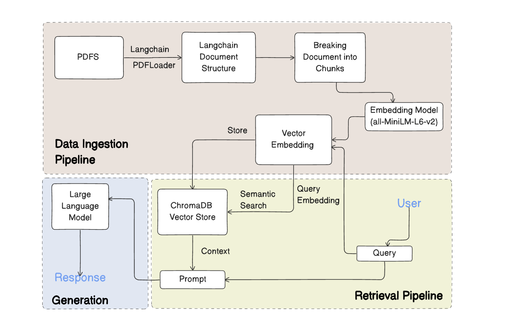

# MiniRAG

A lightweight **Retrieval-Augmented Generation (RAG)** pipeline built to explore how external document knowledge can enhance LLM responses.  
This project demonstrates an end-to-end setup using **PDF data**, **ChromaDB**, and **ChatGroq** with **MiniLM embeddings**.

---

## Set Up Guide
```bash
git clone https://github.com/g14ayushi/GroqRAG.git
cd GroqRAG
pip install -r requirements.txt
jupyter notebook ./notebook/pdfLoader.ipynb
```

## What It Does

1. Loads PDFs. 
2. Splits documents into **semantic chunks**.  
3. Generates **embeddings** using `all-MiniLM-L6-v2`.  
4. Stores embeddings in a **ChromaDB vector store**. 
5. Uses **ChatGroq** for conversations with contextual retrieval.  

---

## 🔄 RAG Pipeline Flow

Below is the high-level flow of the project showing how PDFs are processed and used for contextual responses:

<p align="left">
  
</p>

---

## 💬 Example Query

**Input Question:**  
> What is self-attention?

**With RAG (Context-Aware):**
> Self-attention is a mechanism in deep learning models, particularly in transformer architectures, that allows the model to weigh the importance of different input elements relative to each other. It enables the model to focus on specific parts of the input sequence and attend to them more heavily, rather than treating all elements equally. This helps the model to capture long-range dependencies and relationships within the input data.

**Without RAG (No External Context):**
> Self-attention is a fundamental concept in deep learning, particularly in the field of natural language processing (NLP) and computer vision. It’s a mechanism that allows a model to focus on different parts of the input data and weigh their importance relative to each other.
>
> **What is self-attention?**  
> Self-attention is a type of attention mechanism that allows a model to attend to different parts of the input data and weigh their importance. It’s called “self-attention” because it allows the model to attend to different parts of the input data itself, rather than relying on external information.  
>
> **How does self-attention work?**  
> Self-attention works by computing a weighted sum of the input elements, where the weights are learned during training. The process can be broken down into three main steps:
> 1. **Query** – represents what we’re trying to attend to.  
> 2. **Key** – represents potential matches in the sequence.  
> 3. **Value** – carries information to aggregate.
>
> The formula:  
> `Attention(Q, K, V) = softmax(Q * K^T / sqrt(d)) * V`
>
> Self-attention is widely used in **transformers**, enabling them to model long-range dependencies in **NLP**, **vision**, and **speech recognition** tasks.

---

🧩 **Insight:**  
The “With RAG” response is **concise and focused** since it uses **retrieved context** from uploaded PDFs.  
The “Without RAG” output is **generic and verbose**, reflecting how LLMs behave without external grounding.


## Tech Stack
**Python**, **LangChain**, **ChromaDB**, **SentenceTransformers**, **Groq**, **LLMs**, **Jupyter Notebook**

---

